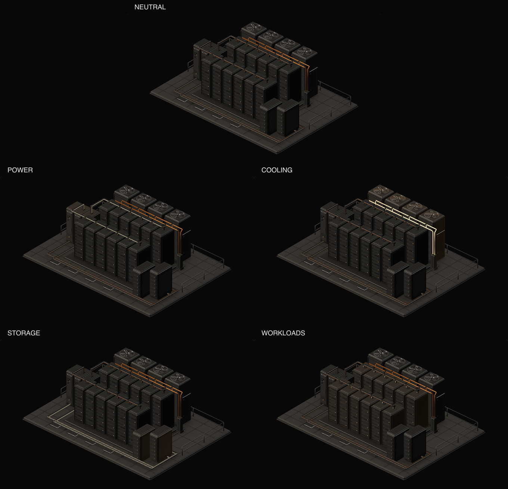
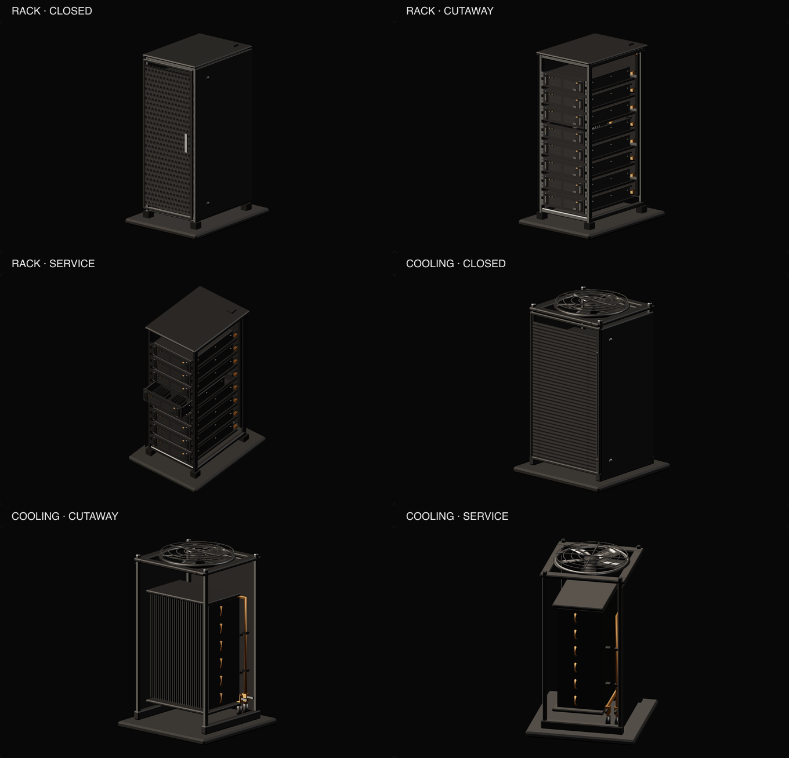

# Facility v4 asset evidence

These artifacts describe the frozen `facility-v4` assets. They verify authored geometry, metadata, export provenance, and still-image appearance. Final browser behavior, lifecycle, accessibility, and performance results are recorded separately; these captures do not establish frame-time or page-metric passes.

## Release and budgets

The [release manifest](release-manifest.json) pins three GLBs, six posters, the render profiles, seven authoring inputs, and three editable Blender masters. All nine frozen file sizes and hashes, capture profile/model/poster hashes, and current source hashes match; see the [evidence index](asset-evidence-index.json).

| Asset | Actual GLB bytes | Working size target | Hard size ceiling | Authored triangles | Closed-view draw calls | Runtime materials |
|---|---:|---:|---:|---:|---:|---:|
| Overview | 2,306,716 | 2,300,000 | 2,500,000 | 32,734 | 39 | 10 |
| Rack specimen | 917,232 | 900,000 | 1,000,000 | 9,866 | 26 | 8 |
| Cooling specimen | 546,792 | 700,000 | 1,000,000 | 4,194 | 17 | 7 |

The overview exceeds its working size target by 6,716 bytes; the rack exceeds its working target by 17,232 bytes. Both satisfy their hard ceilings. The overview remains below the 60,000-triangle target / 80,000 ceiling and at the approximately 39-draw-call working target. Rack and cooling remain below their respective 24,000/18,000 triangle and 35/30 draw-call budgets. Runtime LED instances add 576 overview triangles and 96 rack triangles: the captured closed views render 33,310 / 9,962 / 4,194 triangles.

The captured resident allocation estimates, including the 2.25 MiB studio environment, are 7.07 MiB overview, 5.54 MiB rack, and 5.12 MiB cooling. These satisfy the overview 16 MiB working target / 32 MiB ceiling and the 6 MiB specimen scene budgets. These are estimates, not measurements of total browser process memory. Capture transition peak is 10.35 MiB; repeated-switch stability belongs to the separate runtime report.

Desktop/mobile posters are 47,196 / 15,294 bytes, below the 100 KiB target and 150 KiB ceiling. The four specimen posters range from 14,304 to 18,816 bytes, below their 60 KiB ceiling. Compression sizes in asset reports are estimates; whole-page network transfer must be measured separately.

## Validation and reproducibility

- [Overview validation](validation.json), [rack validation](rack-validation.json), and [cooling validation](cooling-validation.json) report zero Khronos errors. They retain 42 / 25 / 17 generated-tangent-space warnings; normal-map appearance may vary across implementations and still requires browser review.
- Overview validation checks 66 semantic identities, 27 equipment/junction records, 52 ports, 26 rendered routes, 20 explicit internal links, dense route/equipment indices, normalized route coordinates, and four rotor shaft pivots. [Topology](topology.json) and [service validation](service-report.json) describe illustrative connectivity only. They do not establish electrical, hydraulic, thermal, or capacity performance.
- Specimen checks confirm empty chassis cavity points, geometry within authored part bounds, and all pose roots bound. The six-part [rack](rack-metadata.json) and [cooling](cooling-metadata.json) metadata each provide closed, cutaway, and service poses. The rack includes a 180 mm tray extension; the cooling assembly separates the rotor from the stationary guard.
- [Normal preservation](normal-preservation-report.json) records evaluated corner-normal transfer and retained UV seams. [Bake provenance](bake-report.json) records shared 512×512 normal and ORM atlas production in Blender Cycles.
- [Reproducibility](reproducibility-report.json) demonstrates byte-identical re-export of all three saved editable masters in separate pinned Blender 5.2.2 LTS processes. It does not claim two complete procedural regeneration and bake runs were compared. [Overview](asset-report.json), [rack](rack-asset-report.json), and [cooling](cooling-asset-report.json) reports record source and generator hashes.
- [Immutable publications](immutable-publications-report.json): all **32 of 32** baseline files are unchanged—20 assessment publication files and 12 files from facility v1–v3. No missing file or hash mismatch was found.

## Visual evidence

[Capture provenance](capture-profile.json) records the actual browser renderer at 1360×800, DPR 1, with reduced motion. Model, profile, and poster hashes match the frozen release. The clean service views below are browser captures; authoring renders and unrelated intermediate images are deliberately excluded. Still captures establish appearance and pose presentation, not animated fan/LED correctness.

Full-size service details: [rack](rack-service.png) · [cooling](cooling-service.png).
