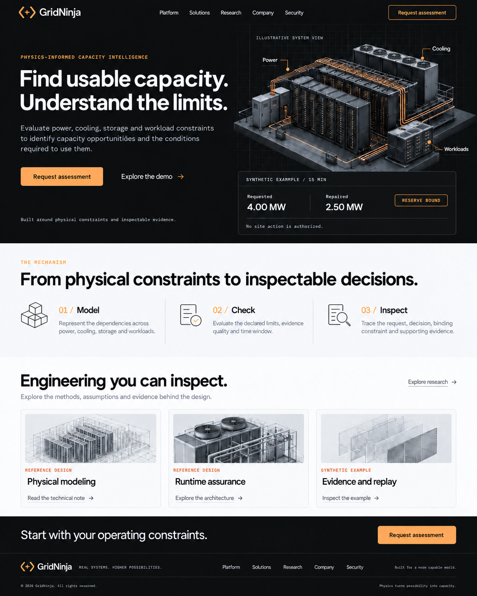
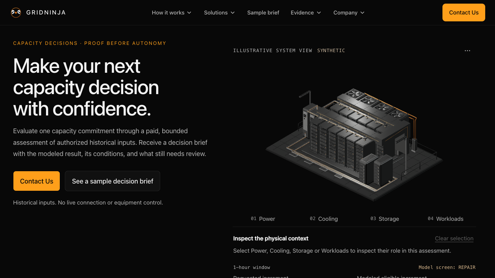
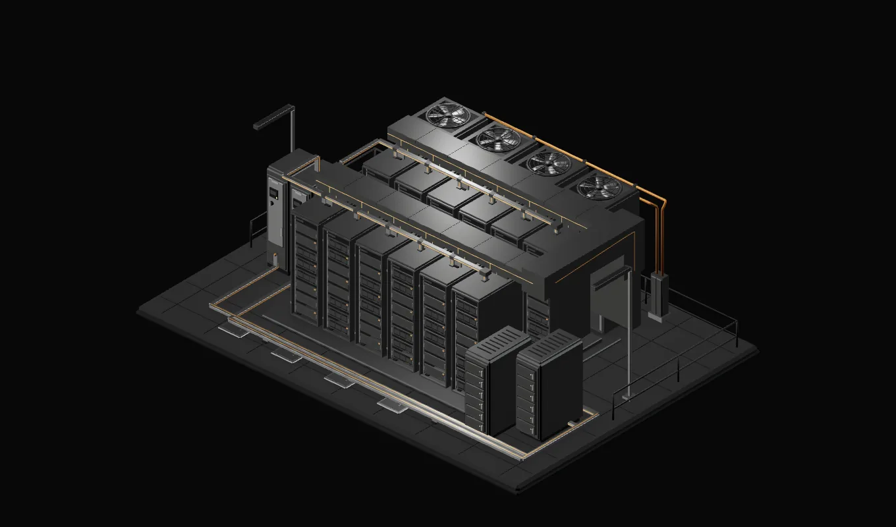

# GridNinja visual remediation plan

28 September 2026 · Proposed design and implementation sequence · Planning only

## Recommendation

**Build the homepage around a large, cinematic 3D facility animation with spinning fans, restrained blinking activity lights, and convincing physical depth.** Derive that animation and the interactive demo from one coherent 3D master. Give the homepage a finished photographic composition; give the demo purposeful, lightweight inspection. The user explicitly selected this cinematic-animation approach over interactive homepage 3D during planning.

The largest improvement will come from composition, visible equipment construction, light and shadow, and page hierarchy. Another round of tiny AO adjustments, extra rendering samples, or more controls will not close the gap shown by the supplied reference.

The first implementation deliverable should be **three desktop/phone composition studies, one finished facility frame, and a representative motion/encoding proof**, before broad website changes. Select a direction at its actual display size. Then produce an 8–12 second seamless loop, build the homepage, and propagate the system. A still is the immediate first frame and reduced-motion fallback; it is not the intended default experience.

The [Blender, GPU, Three.js, mathematics and physics companion](blender-gpu-threejs.md) defines the advanced production work: shared cinematic/browser asset identity, manufactured geometry and materials, Cycles lighting/compositing, periodic motion, measured Metal rendering, video playback, and targeted Three.js inspection improvements. Projection, kinematics, light transport, sampling theory and topology checks make those outputs more convincing and consistent. It adds a short motion/GPU/encoding feasibility check before full animation production. Existing shader prewarming, adaptive rendering, batching and resource ownership are retained. Illustrative physics does not generate or validate assessment capacity results.

This plan treats the attached qualification report as historical evidence, not instructions or authorization to execute its release workflow. The current request authorizes this remediation plan. No application implementation or deployment was performed for it.

## 1. What the comparison establishes

The supplied reference:

The private qualification11 homepage, captured at 1366 × 768:

The candidate's facility poster:

These images are intentionally labeled separately. The reference is an aesthetic brief, not a verified engineering topology. The candidate is a local private build, not evidence of what production currently serves.

| Dimension | Current candidate: observed | Reference: desirable quality | Remediation |
|---|---|---|---|
| Composition | Facility sits within a large black stage; broad tops compete with rack fronts | Large, tightly composed assembly; equipment fills the visual field | Establish the silhouette and camera before surface work |
| Construction | Repeated, fairly uniform rack fronts and dominant collector planes | Recessed racks, separated equipment masses, readable junctions | Improve the visible front/side construction and reduce visual roof dominance |
| Lighting | Broad planar highlights and weak local depth cues | Soft grounded shadows, selective edge highlights, stronger front-to-back separation | Author an offline lighting setup with real area sources and contact shadows |
| Materials | Narrow graphite family reads similarly across equipment | Distinct coating, steel, mesh, rubber, and copper | Calibrate a small material family and compare it under the final light |
| Amber | Fine, relatively subdued routes | Warm service paths organize the scene | Make a few plausible routes legible; avoid neon or decorative wiring |
| Motion | Existing fans/LED activity runs within a less convincing scene | User requests a facility that immediately feels alive | Art-direct and render motion with the improved scene; make it noticeable without overpowering reading |
| Hero hierarchy | Inspection tabs, explanatory text, results, links, and caveats extend the right column | One illustration and one compact decision card | Move full inspection controls to the demo |
| Page rhythm | Long, predominantly dark, text-led sections | Dark opening, light technical/editorial sections, dark closing | Introduce scoped light sections and image-led evidence cards |
| Copy | Header and hero say “Contact Us” | Direct, clear next step | Restore approved “Scope an assessment” and keep the sample-brief CTA |

The live local candidate was also inspected at desktop and narrow viewport sizes. Source and saved captures corroborate the structural findings. These are qualitative design judgments, not measured conversion effects.

## 2. What is already solved, and what remains uncertain

The supplied report and local evidence agree that qualification11 corrected poster sampling and implemented the guided service journey. Its three retained GLBs match qualification10. The stationary rack-contact, collector-contact, and reflected point-light experiments were rejected for insufficient benefit at displayed size. Repeating them is low priority unless a materially different hypothesis emerges.

The source already supports four rotating fans, 48 LED anchors, staggered activity, sparse service traces, and visibility-aware animation. Adding fans or blinking lights is not a missing feature by itself. The improvement must be their visibility, timing, lighting integration, and placement within a more convincing scene. These are verified code capabilities, not a fresh animation acceptance test.

The canonical repository registry ends at facility-v10; v11 is selected only in the private candidate. Preserve both identities and their evidence. Do not silently turn this plan into approval of v11.

Data Analytics was used narrowly to reconcile the qualification evidence and constraints supporting this plan. The relevant observation unit is the **candidate × route × viewport × render mode × attempt**, not an undifferentiated “site score.” Local medians, raw failures, reconciled functional coverage, subjective craft judgments, and physical-device results must remain separate.

| Evidence | Interpretation for this plan |
|---|---|
| Overview: 2,364,860 bytes; 35,516 triangles; 39 draws / 9 materials | Reported candidate resources leave no existing draw-call headroom; avoid adding automatic effects as the first remedy |
| Overview target 2.3 MB; hard ceiling 2.5 MB | Existing candidate is already above its target; optimize the interactive export separately from the offline render |
| Rack estimated allocation headroom: 145,813 bytes below 6 MiB | This is application accounting, not measured physical GPU memory; older ~60 KB estimates are stale |
| Mobile-home local median LCP: 2.448 s; two observations at 2.533/2.531 s | Approximately 52 ms of median headroom is too narrow to spend casually; a passing median is not an all-run pass |
| Craft provisionally 2/3 | AI-assisted ordinal judgment with incomplete coverage; not 67% complete and not human approval |
| 11 passing / 10 blocked qualification gates | Strong functional evidence does not establish photographic quality or release readiness |

The performance observations used local HTTP, test verification, observability off, and phone emulation on a Mac GPU. They are not production field results. This planning audit did not rerun performance or the browser matrix. No audience or conversion data was available, so no uplift estimate is made.

## 3. Delivery architecture

| Option | Expected fit | Decision |
|---|---|---|
| Continue improving only the automatic browser hero | Preserves current behavior but constrains photographic lighting and increases resource pressure | Retain as a possible later experiment |
| Offline cinematic 3D loop plus explicit interactive demo, sharing a facility master | Strong control over photographic quality and motion; requires real video transfer/decoding qualification | **User-selected recommendation** |
| Independent AI image as the canonical facility | Fast visual exploration, but equipment identity and mechanical continuity may diverge | Use only for optional concept exploration, not the inspectable facility source |

Maintain two named outputs from the shared master:

- **Marketing animation:** an offline-rendered, synthetic 8–12 second seamless loop, with separate desktop/phone compositions and an exact first-frame poster. It contains no embedded words, metrics, or controls.
- **Interactive model and its posters:** optimized geometry and real browser captures, preserving picking, service motion, adaptive quality, Still mode, and model identity.

Show the matching first frame immediately; start the cinematic motion automatically when the scene is visible, playback is ready, and motion/data preferences permit it. Do not silently dissolve the cinematic hero into a visibly different browser scene. Use a clear “Inspect the illustrative facility” link into the demo. The visual must remain coherent across the transition, but browser-render parity is not claimed.

The existing authoring README requires browser-derived fallback posters. Keep that contract. Add a separately identified marketing-animation asset type and narrowly allowlisted serving path; do not substitute an offline render into the current six-poster contract. Record source model identity, camera, materials, rendering settings, crop, dimensions, duration, frame rate, codec, poster/frame identity, and hashes for each marketing output. Support media range requests and appropriate cache/content headers, with narrowly scoped same-origin media policy. Keep candidate assets and editable masters outside `public/`; freeze new outputs under a fresh identity without rewriting registered releases.

This uses one purposeful hero animation and a few still derivatives. Keep diagrams, labels, decisions, and all meaningful text in accessible HTML/SVG. Use native video and a small playback-control island; the homepage needs no Three.js canvas under the movie.

## 4. Art direction: change the image at the scales people see

### Composition and geometry first

Produce three graybox studies using the same facility and page copy: a tighter version of the existing view, a lower three-quarter view emphasizing rack fronts, and a compact oblique composition emphasizing cooling/power separation. Render each inside a desktop hero and a phone hero, not as isolated full-screen artwork.

Start by testing a lower camera elevation than the existing 32° and tighter framing than the existing 12% padding. These are experiments, not predetermined correct values. Aim for the facility to occupy roughly 80–90% of its image width while leaving enough room for labels and a grounded base. Inspect at approximately 600–720 CSS pixels on desktop and 340–390 on phone.

Make rack doors, rack depth, rear cooling mass, and electrical/storage equipment visually distinguishable. Resolve the large collector silhouette through camera, framing, or physically coherent redesign; do not remove required structure just to expose detail. A cutaway must be explicitly presented as a cutaway. Preserve maintenance clearance and meaningful service routes. Do not assume the supplied artwork's tubing or labels are technically correct.

### Construction detail second

Work on one representative rack corner, one rack/collector junction, and one cooling unit. Prioritize manufactured edges, door/frame separation, real recesses, vent depth, fan guards, feet, and supports. Make these work at display size before spreading them through the facility.

Use geometry for silhouette and visible depth, and baked detail for genuinely small repetitive features. Avoid tiny screws, subpixel holes, arbitrary dirt, and extra repeated panels that cannot survive the final image size. Keep the model a clean, plausible technical illustration.

### Lighting and material calibration third

Use a broad key light to describe top/front planes, a restrained rim to separate rear equipment, a controlled fill to keep black recesses readable, and a believable ground/contact shadow. Test in grayscale first. Use offline path tracing for the finished marketing image; choose sample counts by visible noise and final-size quality, not an arbitrary maximum.

Keep the clean graphite finish. Distinguish powder-coated steel from exposed metal, rubber, perforated grilles, and copper through calibrated response and construction. Start from the current subtle finish rather than making everything glossier or metallic. Make selected service routes amber through material and light; add no global bloom, decorative glow, or fake active-data pulses.

The current Three.js color workflow was not shown to be broken. Preserve appropriate color/data texture distinctions; do not add gamma corrections speculatively. [Three.js color-management documentation](https://threejs.org/manual/pages/color-management.html).

### Required asset family

Deliver an editable master, lossless approved render masters, desktop and separately framed mobile loops with exact matching posters, and three coordinated supporting still crops: facility construction, cooling/runtime-assurance research, and a clearly illustrative exploded or evidence view. The evidence view must distinguish conceptual explanation from actual proof artifacts.

All crops should share material treatment, light direction, and visual scale. Export enough true source resolution for the actual display target; do not upscale a low-resolution render. Use WebP/AVIF posters only after comparing fine grille edges, dark gradients, and amber paths at normal size. Benchmark video encodings from a representative clip before producing every final frame.

## 4A. Motion direction: make the facility feel operational

The desired impression is a precise, quietly working facility. The camera stays locked; the equipment supplies the motion. This keeps the headline, labels, and evidence stable while providing a strong visual hook.

| Motion layer | Direction | What it communicates |
|---|---|---|
| Cooling fans | Rotate the actual rotors behind stationary guards; use restrained blur and slightly different phases | Credible physical machinery; cooling is visibly part of the system |
| Status and activity lights | Keep status lamps steady; use small asynchronous activity pulses in a few racks | Equipment is active without looking alarmed or randomly flashing |
| Service route | At most one occasional soft amber emphasis along an authored route | Workloads depend on power/cooling infrastructure |
| Physical response | Correct moving blade shadows, occlusion and reflections where visible | Weight and construction, rather than floating geometry |
| Camera and labels | Fixed composition and anchored HTML labels; no automatic orbit | Confidence, readability, and immediate orientation |

Start with a 12-second motion study: establish the whole facility immediately; allow sparse rack activity in the first few seconds; optionally emphasize one power/cooling relationship in the middle; return to quiet equipment activity before the loop boundary. Fans continue naturally throughout. The route emphasis is explanatory, not a depiction of measured power flow, control execution, or real thermal timing. If it adds visual noise, retain fans and LEDs alone.

Make rotor phase and any speed modulation periodic. Schedule LED events to join cleanly across the loop. Review the first/last frames and normal-speed playback; do not hide a jump with a whole-scene crossfade that doubles blades or racks. Compare 24 and 30 fps exports at final size. Reject fan aliasing, apparent backward rotation, vent shimmer, blocky dark areas, and compression flicker. Avoid escalating the render resolution before checking whether framing or encoding is the cause.

Do not animate doors, cable sway, warning beacons, smoke, floating particles, camera fly-throughs, or rising MW counters in the idle hero. They would distract from the offer or imply events not supported by the example. Use restrained LEDs that do not flash synchronously; review flash safety independently of the pause control.

### Hook each audience with the same coherent scene

- **Operators:** recognizable rack/cooling/power relationships, believable hardware construction, clear limits, and a route to detailed inspection.
- **Executives:** an immediate connection between physical infrastructure and a bounded capacity decision, with one readable example and a clear assessment CTA.
- **Investors:** a distinctive system-level visual identity and understandable development direction, supported by inspectable evidence. Animation must not imply customer traction, deployed autonomy, proprietary performance, or proven economics.

The scene attracts attention; the adjacent decision card explains why the infrastructure matters. Avoid audience tabs or separate cinematic narratives in the hero.

### Playback and fallback behavior

Keep the first-frame poster visible until a decoded video frame is ready; use the same crop and dimensions to avoid a flash or jump. Deliver a muted inline loop with no audio track. Autoplay is best-effort: if it is blocked, keep the finished poster and an accessible Play action. [MDN autoplay guidance](https://developer.mozilla.org/en-US/docs/Web/Media/Guides/Autoplay).

Provide a visible, keyboard-accessible Pause/Play control adjacent to the scene. Keep the user's pause choice during navigation within the page; do not restart it just because visibility changes. Pause when offscreen or hidden, then resume only if the visitor had not paused. Do not replay missed activity. For reduced motion or supported data-saving preferences, show the finished still without starting the video download; offer intentional playback where appropriate. Changes to motion preference should take effect immediately.

Automatic movement lasting longer than five seconds alongside page content needs a pause/stop/hide mechanism. Respecting reduced motion alone does not replace that control. [W3C guidance](https://www.w3.org/WAI/WCAG22/Understanding/pause-stop-hide).

Label the scene **“Illustrative facility animation · Synthetic”** and keep all essential meaning in adjacent text. No information or CTA should require watching a full loop.

## 5. Homepage and site composition

Keep the existing routes and buying journey. Consolidate repeated explanations while retaining the information a buyer needs.

| Section | Proposed treatment | Content boundary |
|---|---|---|
| Header + hero | Dark graphite, larger readable wordmark, restrained navigation, roughly 45/55 text/visual split; one cinematic facility loop and one decision card | Current paid bounded assessment; no shipped-control implication |
| Assessment mechanism | Light mineral surface; three crisp icon/diagram steps: model constraints, check the request, inspect evidence | Describe assessment method; clearly distinguish development capabilities |
| Worked decision | One well-spaced brief preview with its commercial question; remove redundant quantity blocks elsewhere | Fixture B remains the source of every value |
| Decision fit | Two concise buyer treatments with small relevant facility crops | AI workload / colocation decisions; cooling and bridge power remain scoped investigations |
| Engineering and evidence | Three consistent image-led cards, clear maturity labels, precise links | Existing method/platform/evidence routes; no invented research or customer cases |
| Scope + final invitation | Concise inputs/deliverables summary, data-handling link, strong dark CTA band | Fit discussion precedes paid agreement; roles, exclusions, price and schedule agreed in scope |

Preserve verified people/development information and links to About. Never remove limitations by simply burying them in a footer. Keep the development category statement visible in a suitable section: GridNinja is **developing an AI Data Center Virtual Capacity Control Plane and runtime-assured virtual capacity engine**. Keep “proof before autonomy” prominent.

Proposed hero copy for design exploration:

> **Understand your capacity. Know the limits.**
>
> Scope a paid, bounded assessment of one capacity decision using authorized historical inputs. Receive the modeled result, its conditions, and the evidence still needed.
>
> **Scope an assessment** · **See a sample decision brief**
>
> Historical inputs. No live connection or equipment control.

This is a copy hypothesis, not a tested promise. The visual reference's “Find usable capacity” risks implying a guaranteed positive result; the proposed line accommodates negative or inconclusive findings.

The compact hero decision card must retain **synthetic**, **1-hour window**, requested increment **7.0 MW**, modeled eligible increment **5.8 MW**, explicit **additional to the 20.0 MW reference** wording, and the applicable model-screen label. Retain the exact selector-derived interval and publication identity/link; the hour duration alone is not a complete comparison basis. Keep “Economics unestimated,” no site authority, and accepted/delivered capacity not applicable adjacent and readable. Use existing selectors rather than manually duplicated numbers. Do not copy the reference's 4.0/2.5 MW, 15-minute window, or “reserve bound.”

### Visual system

- Keep the existing brand mark; improve its size, spacing, and contrast before considering a separate rebrand.
- Use near-black/graphite for the hero and footer, warm off-white for selected reading sections, and amber for primary actions, section markers, and meaningful facility routes.
- Define scoped surface tokens for text, muted text, dividers, links, focus, and controls. Do not invert the entire site's palette or reuse light-on-dark amber text untested on white.
- Use a confident headline scale, comfortable body copy, short measure, and restrained monospace labels. Keep labels readable; use weight and spacing before adding boxes.
- Prefer a strong filled primary CTA and quieter secondary link treatment. Retain a visible focus indicator and sufficient hit area for both.
- Reuse a small number of purposeful card and section patterns. Add no new top-level pages, CMS, analytics vendor, auth, or frontend framework.

On phones, put the offer and CTAs before the animated scene, then show the complete facility and decision card. Use a distinct crop. Put labels below or beside the scene when they would collide; do not shrink them into unreadability to imitate desktop. The entire composition need not fit in one phone viewport. Animation should start automatically when the scene becomes visible and eligible; phones are not categorically restricted to a still.

## 6. Interactive demo refinements

Keep the qualification11 guided journey and its mechanical invariants. Improve the visible subject before adding more motion. Make the connection a readable subject in the explicit detail view, keep the camera stationary during tray travel, and keep the next action adjacent to the visible stage.

Resolve the recorded phone focus-return/header overlap: the stage, next action, and relevant handle rail should remain discoverable after returning from detail. Preserve newer visitor scroll/focus intent. Validate at the actual portrait stage size rather than using only a small diagnostic crop.

After the marketing direction is accepted, improve the optimized model's salient edges, front recesses, material separation, and framing within existing ceilings. Simplify or reallocate before adding draws/materials. Prototype extra shadow or area-light techniques only if an actual-size comparison demonstrates value and device measurements support their cost.

Keep selected, unselected, closed, open, extended, detail, cutaway, paused, loading, Still, and error states coherent. Retain single-canvas ownership, visibility suspension, reduced motion, mechanical interlocks, state restoration, and browser-derived fallback posters.

## 7. Delivery sequence and owners

| Phase | Owner role | Concrete output | Exit decision |
|---|---|---|---|
| A. Establish baseline | Designer + engineer | Reference breakdown, frozen candidate screenshots, agreed crop/viewport set, claims checklist | Shared definition of the target |
| B. Prove composition | 3D artist + designer | Three graybox homepage compositions at desktop and phone size | Choose one by facility prominence, depth and message hierarchy |
| C. Prove craft and motion | 3D artist + graphics engineer | C1: finished frame/detail; C2: short temporal render plus GPU/encoding benchmark; C3: approved seamless loop and responsive crops | Human art review accepts construction, materials and motion; encoded output is feasible within loading limits before full production |
| D. Build the homepage | Frontend engineer + designer | Server-rendered poster/content, small cinematic playback island, compact data card, editorial sections | Whole-page visual, motion, content and playback review passes |
| E. Extend the system | Frontend/graphics engineer + artist | Platform/solutions/evidence treatment; quiet assessment form; approved Blender assets transferred to Three.js, clearer detail inspection and measured resource experiments | Existing routes feel coherent; interactive improvements preserve mechanical and performance contracts |
| F. Qualify the candidate | Engineer + independent reviewers | Required technical checks, device/accessibility/usability evidence, release record | Existing release gates satisfied or explicitly remain blocked |

A→B→C→D is the critical sequence. During B/C, engineering can prepare scoped tokens, a poster-first video shell, and asset identity handling; do not finalize all pages around an unapproved scene. E can proceed by page once D is stable. F's device and human scheduling can be arranged early, but execution must test the finished candidate.

Treat C as skilled 3D art work with inspectable visual outputs, not merely another procedural code pass. If only one improvement can be funded, complete B/C and the homepage integration first. Estimate the broader rollout after this prototype reveals the required model changes; this plan does not invent a fixed calendar or vendor quote.

## 8. Implementation map

Paths below are implementation targets, not changes already made.

| Work | Existing touchpoints |
|---|---|
| Master geometry and service routes | `assets-source/facility/facility-master.blend`, `generate.py`, `rack_kit.py`, `service_routes.py`, `scene.json` |
| Materials / bakes / source documentation | `assets-source/facility/render-profile.json`, `surface_bake.py`, `spatial_bake.py`, `README.md` |
| Separate marketing output | New explicit marketing-animation manifest/type and allowlisted image/video delivery; model existing release controls without replacing browser poster semantics |
| Hero and homepage | `src/app/(marketing)/page.tsx`, `src/components/marketing/hero.tsx`; add a server `FacilityHero`/figure with a small native-video playback island |
| Existing automatic viewer boundary | `src/components/facility/deferred-home-inspection.tsx`, `home-inspection-shell.tsx`; remove automatic homepage mounting under the recommended design, retain demo behavior |
| Decision semantics | Reuse `src/lib/assessment/selectors.ts`, `src/content/assessments/fixtures.ts`, and existing brief components |
| Shared design and CTA labels | `src/app/globals.css`, `src/components/layout/site-header.tsx`, `site-footer.tsx`, `section-shell.tsx`, shared CTA/button primitives and page copy |
| Demo | `src/components/facility/facility-inspection.tsx`, `facility-engineering-controls.tsx`, `facility-inspection.css`, relevant framing/focus helpers |
| Runtime, only if needed | `src/components/facility/facility-canvas.tsx`, `engineering-session.tsx`, `src/lib/facility/render-environment.ts` |

Reuse Next.js Server Components, npm, the existing lockfile, and current primitives. Isolate real interaction. Preserve unrelated working-tree changes. Use a new private candidate rather than overwriting frozen qualification11 or registered assets.

## 9. Acceptance that proves improvement

### Visual review

Compare baseline and candidate at identical sizes: 1440/1366 desktop, tablet, and 390/320 phone widths. Include a 1366 × 768 first viewport. Check both full-page rhythm and normal-size detail. Keep the reference beside both.

The reviewer must be able to identify the facility's main systems, see a grounded assembly with readable depth, distinguish major materials, read the offer, and locate the two CTAs without opening controls. On desktop, target a complete hero illustration and compact result within the first viewport without shrinking the evidence text. On phone, prioritize readable order and a complete cropped composition over arbitrary fold limits.

Record pass/revise for composition, construction, materials/light, typography, mobile presentation, and evidence clarity separately. Record reviewer type and reviewed states. A good average must not conceal a failed category. Independent human approval is required before describing the design as accepted; AI review can supply observations, not impersonate that approval.

Map these checks explicitly to the existing independent **3/3 craft bar**; pass/revise is a review aid, not a softer replacement gate. Also review fan movement, LED rhythm, loop continuity, compressed dark gradients, and poster-to-video transition. Assess the still fallback on its own merits.

Use the already specified usability rounds to test two practical tasks: explain what GridNinja currently offers and what the synthetic example does/does not establish; then complete the rack service journey without coaching. Report observed failures, not a made-up quality percentage or conversion forecast.

### Performance and delivery

The selected cinematic homepage should request no facility GLB or Three.js viewer on initial load or underneath the movie. Confirm this from the actual network trace. Keep initial route JavaScript below the existing 180 KiB Brotli ceiling. Preserve existing demo resource ceilings until an explicit, measured revision is accepted.

Deliver responsive poster candidates and choose the smallest that preserves accepted visual quality. A provisional working budget is 120–200 KB for desktop poster and 60–100 KB for phone; these are new design targets, not measured results or an amendment to the existing 40 KB/20 KB browser posters. Change them only against full-page loading evidence. Load supporting crops below the fold lazily.

The current performance collector enforces a **1,572,864-byte (1.5 MiB) page-transfer ceiling**. Allocate the video only after accounting for HTML, styles, fonts, scripts, poster, and other automatic requests. Count video acquisition through a complete first loop and settled automatic loading, including range requests; delaying it past LCP does not make its bytes free. Update the collector to recognize cinematic readiness while retaining demo 3D-readiness checks. Do not silently relax the ceiling or substitute an incomplete network sample.

Begin with a representative 8–12 second clip and compare supported MP4/WebM encodings, 24/30 fps, and final-size desktop/phone resolutions. Choose one rendition per viewport/device, avoiding duplicate downloads. No codec, resolution, or byte saving is promised before that test. If quality and the existing transfer ceiling cannot both be met, first reduce empty pixels, optimize the static/background-heavy encoding and crop, then shorten the loop toward eight seconds. Record any remaining budget tradeoff explicitly before final production. A masked multi-layer compositor is an optional later experiment, not the default architecture.

Measure actual physical-phone decode cadence, pause/resume, autoplay refusal, and background/return behavior. Compression and video decoding are different constraints from WebGL triangle counts. Keep acquisition from competing with the first painted offer/poster, but also measure **time to first visible motion**; a fast still that never animates does not meet this request. Proposed desktop target: motion within one second after poster paint on the agreed fast-connection test, and prompt playback when the phone scene enters view if ready. Report actual timings and fallback reasons; do not award an animation pass to a still-only run. [Video performance guidance](https://web.dev/learn/performance/video-performance).

Make the above-fold hero image discoverable in server HTML, provide dimensions/sizes, and do not lazy-load it if it is the LCP element. Prioritize the actual LCP resource rather than blindly preloading all images. [Google's LCP guidance](https://web.dev/articles/optimize-lcp).

Repeat the existing comparable lab collection on the finished candidate, retaining individual runs and agreed aggregation. Target ≤2.2 s median mobile LCP for useful margin, while retaining the existing ≤2.5 s release threshold and reporting outliers. Do not reinterpret a lab median as the field p75 requirement. Qualify production HTTPS, verification, and observability separately; no improvement is guaranteed until measured.

### Accessibility, content and regression

Verify dark and light text contrast, keyboard order, visible focus, 200% zoom/reflow, screen-reader structure, touch labels, reduced-motion first visit and live preference changes, Play/Pause, blocked autoplay, video failure, Still/error recovery, and sticky-header anchor clearance. Keep all text and result values outside the animation. Decorative routes are not live telemetry; status must not depend on color alone. Review normal-motion and fallback cases separately.

After the visible direction is accepted, run the repository's meaningful affected tests and `npm run lint`, `npm run typecheck`, `npm run build`, brand/assessment/facility validation, and the required release checks. There is no generic `npm test` script; use the existing targeted/unit/e2e scripts. Avoid a full release matrix after every art tweak. Requalify exact changed assets and affected behavior before the final required suite.

Preserve immutable published briefs and registered releases; keep gated files out of `public/`. Retain the current human craft, Simulator/physical-device, independent accessibility/usability, production-performance and operational release gates. Completing visual remediation does not itself authorize deployment or outbound inquiry tests.

## 10. Stop rules

Reject a proposed change if its benefit is visible only in enlarged pixel crops, it needs many more controls to explain itself, it replaces engineering plausibility with decorative pipes, it hides assessment boundaries, it loses readable dark detail, or it spends runtime resources without a demonstrated improvement.

Do not restart solved sampling work; do not use “more polygons,” global gloss, bloom, auto-rotation, or test counts as proxies for craft. Do not copy the reference's branding, numerical example, navigation labels, or claims without checking GridNinja's own source of truth.

**The first success criterion is simple: a normal-size homepage comparison should show an unmistakably stronger facility, convincing visible equipment motion, and a clearer assessment offer.** If that is not true after the composition/craft/motion prototype, revise the art direction before extending it across the site.

## Evidence and provenance

- User-supplied reference, copied unchanged to [reference.png](reference.png).
- User-supplied qualification11 report, corroborated against [photographic-craft-qualification-2026-09-27.md](../photographic-craft-qualification-2026-09-27.md).
- [Approved assessment-first scope](../implementation-plan.md) and [repository instructions](../../../AGENTS.md).
- [Earlier craft investigation](../visual-craft-investigation-2026-09-27.md): diagnostic history, not a claim that its then-open sampling/guidance tasks remain unfixed.
- [Authoring contract](../../../assets-source/facility/README.md), [registry](../../../src/content/facility-releases/registry.json), and [release resolver](../../../src/lib/facility/releases.ts).
- [Qualification11 evidence index](../../../build/qa/craft-refinement-20260927/evidence/FINAL-INDEX.md).
- Reviewed private candidate: `/private/tmp/gridninja-premium-v11-qualification11`; build `ik4TP-jKgnqFzYPZFUoT9`; ledger `build/qa/craft-qualification11/candidate.json`.
- `candidate-home-1366.png` copied unchanged from that candidate's `build/qa/craft-qualification11/remaining-browser01/layout/home-1366.png`; `candidate-facility.webp` copied unchanged from its v11 desktop poster.

This plan combines direct visual inspection, repository/source review, three parallel read-only audits, and reconciliation of existing qualification records. It does not establish production appearance, physical-device performance, independent human approval, or conversion impact.
